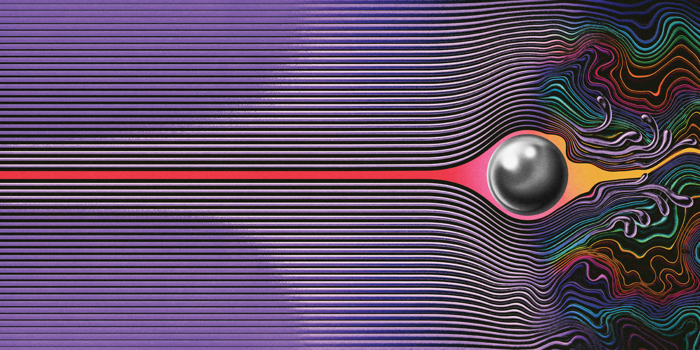

# Olá! Eu sou o Guilherme 👋

Com interesse em tecnologia, programação e resolução de problemas, atualmente estou aprofundando meus estudos em Ciência da Computação e desenvolvimento backend. Gosto especialmente de áreas relacionadas a lógica, matemática e sistemas. 🚀

🎓 Cursando Ciência da Computação - UFBA

👨‍💻 Trainee em Backend da TITAN

---

## 📫 Você pode me encontrar em:

---

## 🎯 Objetivos

- Evoluir como desenvolvedor backend
- Aprimorar lógica de programação
- Participar de projetos reais
- Aprender boas práticas de arquitetura
- Contribuir cada vez mais na TITAN

---

## 💻 Principais Tecnologias

---

## 🎯 Atualmente aprendendo

- Arquitetura backend
- Node.js
- Banco de dados relacionais
- Programação Orientada a Objetos
- Programação competitiva

---

  <a href="https://open.spotify.com/album/79dL7FLiJFOO0EoehUHQBv">
  

  <i>"Yes, I'm changing."</i>

