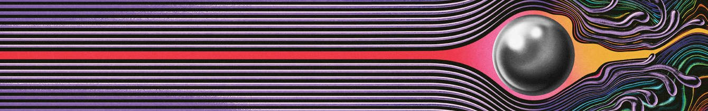

# Hi, I'm Guilherme

Passionate about technology, programming, and problem-solving. I am currently deepening my studies in Computer Science and back-end development, with a strong focus on logic, mathematics, and systems architecture.

- **Education:** B.S. in Computer Science at UFBA
- **Experience:** Back-end Developer at [TITAN](https://www.titanci.com.br/)

---

## Connect with me

---

## Goals

- Evolve as a back-end developer and master system architecture
- Improve programming logic and algorithm optimization
- Contribute to real-world applications and scalable projects
- Implement software engineering best practices and agile workflows (Gitflow)
- Deliver increasing value as a developer alongside the team at TITAN

---

## Technologies & Tools

---

## Currently Learning

- Back-end Architecture & API Design
- Relational Databases & ORM integrations
- Advanced CRUD operations and Data Validation
- Quantum Computing fundamentals (Qiskit)

---

  

  <i>"Yes, I'm changing."</i>

